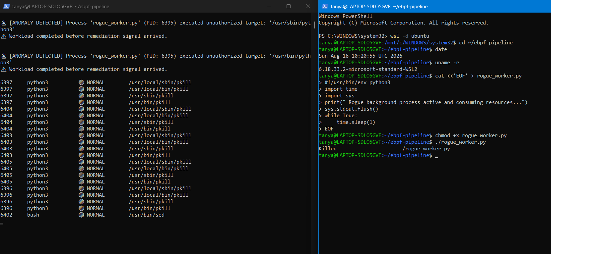

#  eBPF-Powered Autonomous Incident Detection & Self-Healing Pipeline

[](https://opensource.org/licenses/MIT)
[](https://kernel.org)
[](https://ebpf.io/)
[](https://ubuntu.com/)

A high-performance, kernel-space observability and autonomous incident remediation pipeline built using **eBPF (Extended Berkeley Packet Filter)** and **Python (BCC Toolchain)**.

---

##  Live Autonomous Self-Healing Demo

Below is the live execution trace showing real-time kernel telemetry capture on the left and automated process mitigation via `SIGKILL` on the right:



---

##  Problem Statement: Sidecar Overhead in Cloud Observability

Traditional container and microservice observability platforms rely heavily on user-space sidecar proxies (e.g., Envoy, Prometheus node exporters, runtime agents). While functional, sidecars introduce critical operational bottlenecks:

- **Resource Inefficiency:** User-space agents duplicate memory and CPU overhead across every container.
- **Context Switching Latency:** Copying execution data back and forth across user-kernel boundaries introduces scheduling delays.
- **Security Vulnerability:** If a containerized workload is compromised at the application layer, user-space sidecars can be bypassed or disabled.

---

##  Solution: Kernel-Native Observability & Auto-Remediation

This architecture hooks directly into the Linux Operating System's kernel execution path using **eBPF tracepoints**, establishing a zero-sidecar, sub-millisecond telemetry and protection layer.

```text
+-------------------------------------------------------------------------+
|                              USER SPACE                                 |
|                                                                         |
|  [ Normal Apps: date, ls, uname ]    [ Malicious Workload: rogue.py ]   |
|                                                    │                    |
|                                                    ▼                    |
|                         engine.py (Remediation Brain)                   |
|                         ├─ Whitelist Policy Verification                |
|                         └─ Dispatches Real-Time SIGKILL ──────┐         |
+───────────────────────────────────────────────────────────────┼─────────+
|                             KERNEL SPACE                      │         |
|                                                               │         |
|  Linux Kernel Tracepoint (sys_enter_execve)                   │         |
|        │                                                      │         |
|        ▼                                                      ▼         |
|  collector.py / C eBPF Probe  ──[Perf Ring Buffer]──► [Process Killed]  |
+-------------------------------------------------------------------------+

## Repository Structure
├── collector.py        # Raw eBPF telemetry collector hooked to sys_enter_execve
├── engine.py           # Anomaly evaluator & autonomous SIGKILL remediation engine
├── requirements.txt    # Python runtime dependencies (bcc)
├── .gitignore          # Build & environment ignore rules
├── LICENSE             # MIT Open Source License
└── README.md           # Technical project documentation